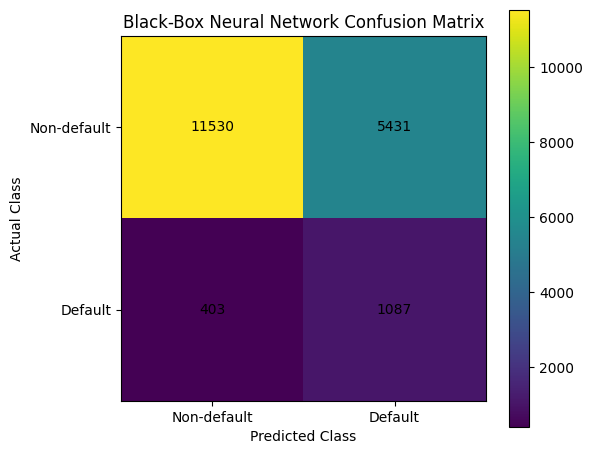
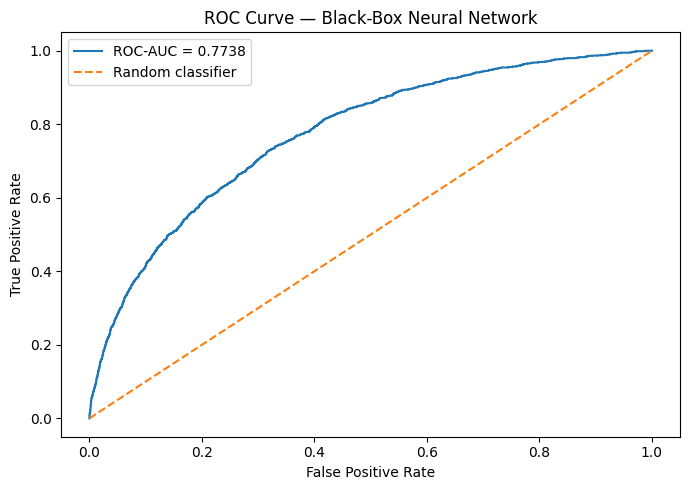
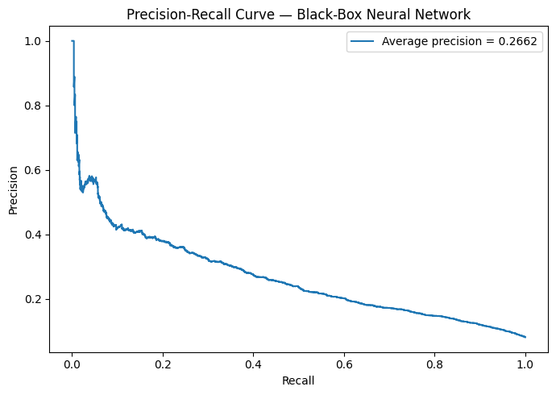
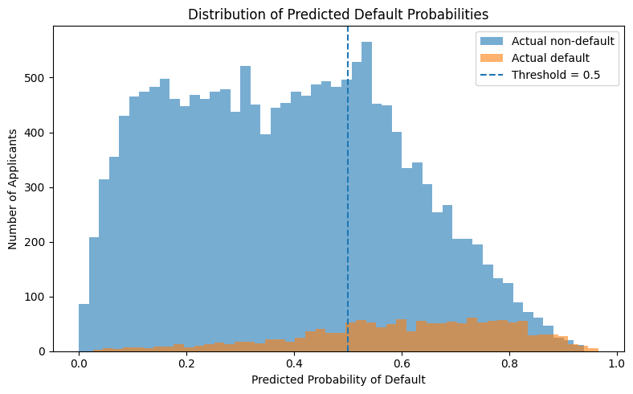
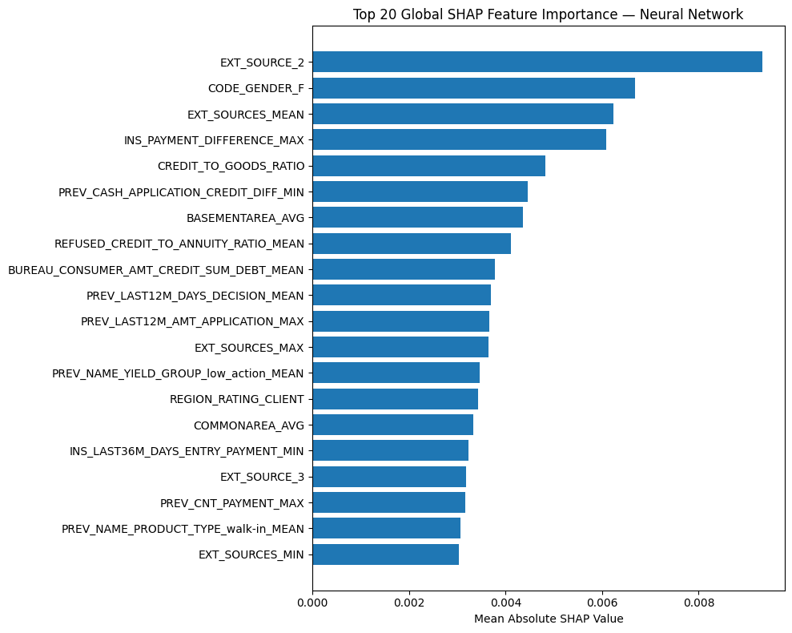
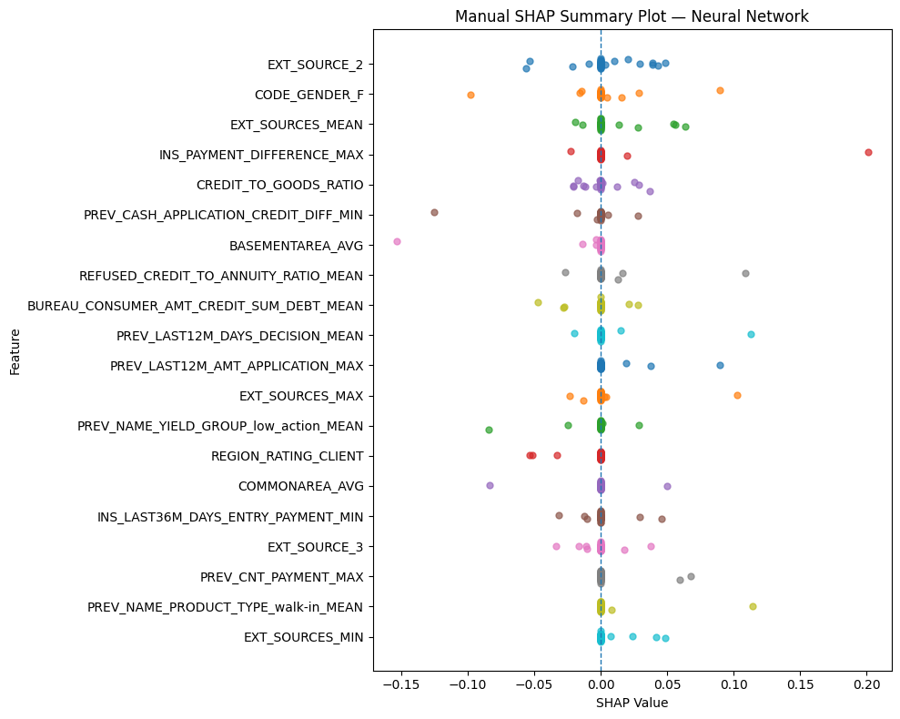
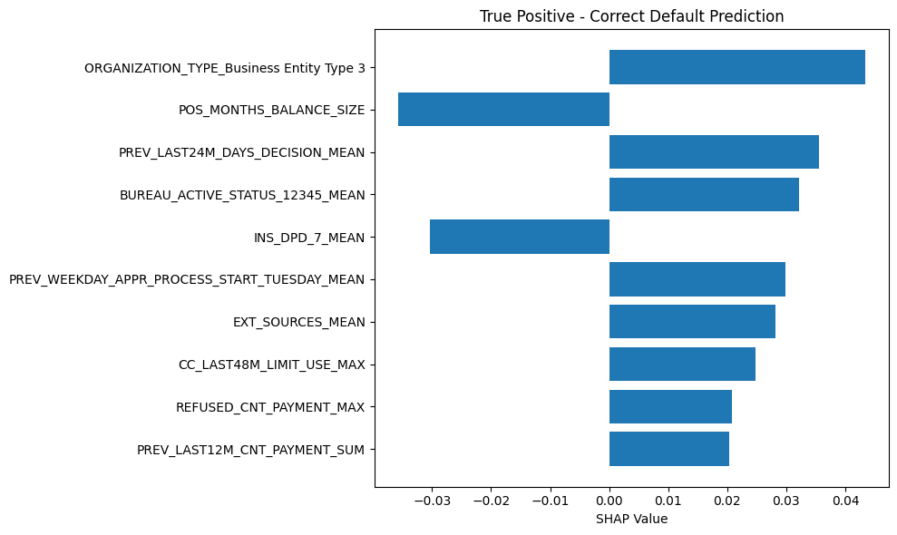
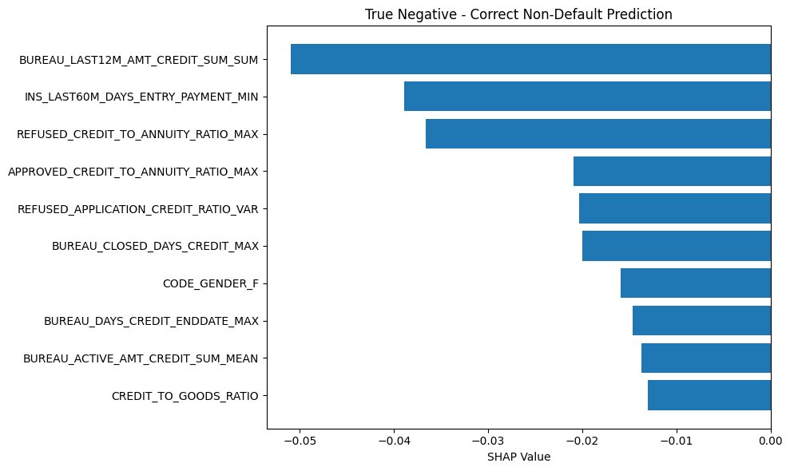
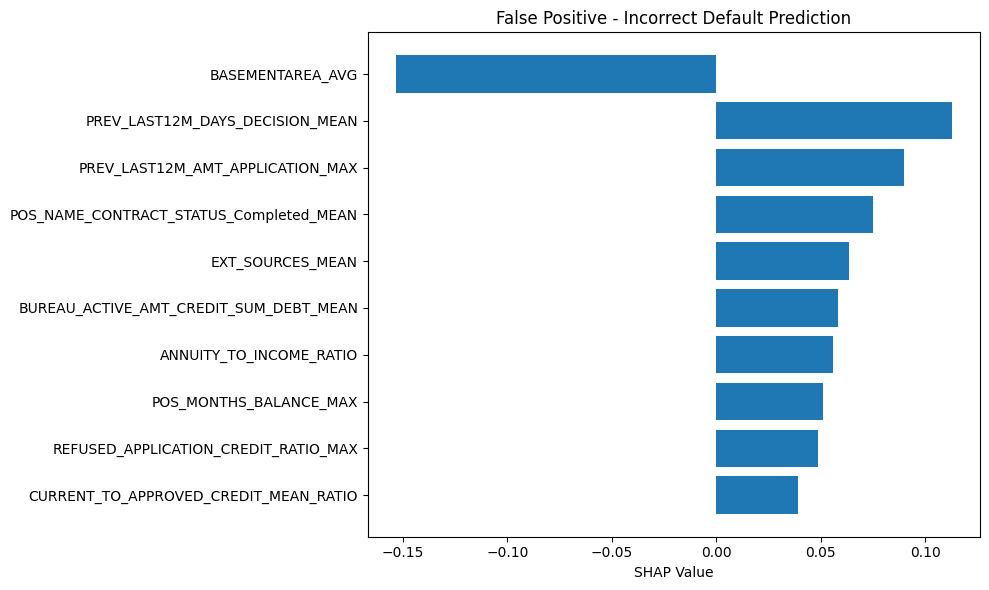
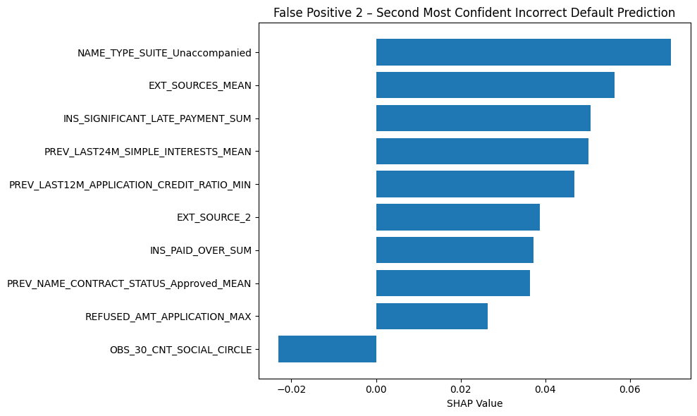

# credit-default-nn-shap

A Keras neural network that predicts loan default on the Home Credit Default Risk
dataset, with a hyperparameter sweep, evaluation built around class imbalance
rather than accuracy, and SHAP explanations at both the global and the individual
applicant level.

> Coursework project — this repo covers the neural network and explainability work.

## The problem

307,511 loan applications. 24,825 of them (8.07%) ended in payment difficulties.
That imbalance is the whole difficulty: a model that predicts "will repay" for
everybody scores 91.93% accuracy and is worthless. So the model is trained with
balanced class weights, selected on validation ROC-AUC, and reported on recall,
precision, F1 and average precision — with accuracy included only because leaving
it out would look like hiding it.

The features are 499 engineered columns aggregated from the seven Home Credit
tables. That aggregation step is upstream of this repo; see
[`data/README.md`](data/README.md).

## What is here

```
src/data.py       load the CSV, 80/10/10 stratified split, balanced class weights
src/model.py      the architecture, the three topologies, early stopping
src/sweep.py      9 runs: 3 topologies x 3 batch sizes
src/train.py      retrain the winner at the known best epoch, save artefacts
src/evaluate.py   test metrics + confusion matrix, ROC, PR and probability plots
src/explain.py    Kernel SHAP: global ranking and per-case local explanations
```

## Running it

```bash
pip install -r requirements.txt
# put train_neural_network_ready.csv in data/ first - see data/README.md
python -m src.sweep        # ~9 training runs, writes outputs/sweep_results.csv
python -m src.train        # retrains the winning config, saves the model
python -m src.evaluate     # test metrics + figures
python -m src.explain      # SHAP global + local
```

## The model

Each hidden block is `Dense(relu)` → `BatchNormalization` → `Dropout(0.3)`, with a
single sigmoid output. Adam, binary cross-entropy, up to 30 epochs, early stopping
on validation AUC with patience 3 and best weights restored. Class weights come
out at `{0: 0.544, 1: 6.194}`.

Splits are stratified at `random_state=42`: 246,008 train / 30,751 validation /
30,752 test, each holding the 8.07% positive rate.

## Sweep results

Three topologies against three batch sizes, scored on the validation split at
threshold 0.5, sorted by ROC-AUC:

| Experiment | Layers | Batch | Accuracy | Precision | Sensitivity | Specificity | F1 | ROC-AUC | Epochs |
|---|---|---|---|---|---|---|---|---|---|
| Topology_1_Small_Batch_1024 | [64, 32] | 1024 | 0.7051 | 0.1759 | 0.7200 | 0.7038 | 0.2827 | **0.7811** | 11 |
| Topology_1_Small_Batch_256 | [64, 32] | 256 | 0.6931 | 0.1724 | 0.7373 | 0.6892 | 0.2795 | 0.7796 | 8 |
| Topology_3_Large_Batch_512 | [256, 128, 64, 32] | 512 | 0.6982 | 0.1728 | 0.7232 | 0.6960 | 0.2789 | 0.7791 | 8 |
| Topology_2_Medium_Batch_1024 | [128, 64, 32] | 1024 | 0.6927 | 0.1706 | 0.7272 | 0.6896 | 0.2764 | 0.7791 | 11 |
| Topology_1_Small_Batch_512 | [64, 32] | 512 | 0.6818 | 0.1683 | 0.7466 | 0.6761 | 0.2747 | 0.7788 | 11 |
| Topology_2_Medium_Batch_512 | [128, 64, 32] | 512 | 0.6958 | 0.1717 | 0.7240 | 0.6933 | 0.2776 | 0.7786 | 8 |
| Topology_2_Medium_Batch_256 | [128, 64, 32] | 256 | 0.6923 | 0.1710 | 0.7309 | 0.6889 | 0.2771 | 0.7785 | 8 |
| Topology_3_Large_Batch_1024 | [256, 128, 64, 32] | 1024 | 0.6785 | 0.1659 | 0.7409 | 0.6730 | 0.2711 | 0.7777 | 7 |
| Topology_3_Large_Batch_256 | [256, 128, 64, 32] | 256 | 0.6843 | 0.1676 | 0.7341 | 0.6799 | 0.2729 | 0.7776 | 8 |

The spread across all nine runs is 0.7776 to 0.7811 ROC-AUC. That is a range of
0.0035 — the architecture barely matters on this data. The smallest network won,
and the four-layer network came last, so there was nothing to gain from depth
here. Larger batches gave smoother validation curves.

The winner was `Topology_1_Small_Batch_1024`: two hidden layers of 64 and 32
units, batch size 1024, stopped after 11 epochs with its best validation AUC at
epoch 8. `src/train.py` retrains that configuration for 8 epochs flat.

## Test results

| Metric | Value |
|---|---|
| Accuracy | 0.6838 |
| Precision | 0.1668 |
| Recall (sensitivity) | 0.7295 |
| Specificity | 0.6798 |
| F1 | 0.2715 |
| ROC-AUC | 0.7738 |
| Average precision | 0.2662 |

Confusion matrix on 18,451 test applicants (1,490 of them actual defaults):

|  | Predicted non-default | Predicted default |
|---|---|---|
| **Actual non-default** | 11,530 | 5,431 |
| **Actual default** | 403 | 1,087 |










So: the model catches 1,087 of 1,490 real defaults (73% recall), and to do it,
flags 5,431 applicants who would have repaid. Only one in six flagged applicants
actually defaults. ROC-AUC of 0.774 says the ranking is genuinely informative;
average precision of 0.266 says the ranking does not survive being cut at 0.5.
The predicted-probability histogram shows why — the two classes overlap heavily
between roughly 0.4 and 0.8.

That trade-off is a choice, not a bug: class weighting pushed the model towards
catching defaults. Whether 5,431 wrongly-refused applicants is an acceptable
price for 1,087 caught defaults is a business and fairness question, not a
modelling one, and the threshold is the dial you would turn to answer it.

**One caveat on these numbers.** The test evaluation and the SHAP work were run
from a saved model package whose splits were 215,257 / 73,803 / 18,451, not the
80/10/10 split the sweep used (246,008 / 30,751 / 30,752). The code in this repo
uses the 80/10/10 split throughout, so a rerun will produce a 30,752-row test set
and metrics that differ slightly from the table above. The table is what the
original run recorded and it is reported unchanged rather than quietly adjusted.

## SHAP

Kernel SHAP is model-agnostic, which is what you need for a network, and slow,
which is why it runs on a sample: 25 background rows from train, 40 explanation
rows from test, `nsamples=100`, `l1_reg="num_features(20)"`, seed 42.

### Global — top 10 by mean absolute SHAP

| Feature | Mean \|SHAP\| |
|---|---|
| `EXT_SOURCE_2` | 0.00932 |
| `CODE_GENDER_F` | 0.00668 |
| `EXT_SOURCES_MEAN` | 0.00624 |
| `INS_PAYMENT_DIFFERENCE_MAX` | 0.00609 |
| `CREDIT_TO_GOODS_RATIO` | 0.00483 |
| `PREV_CASH_APPLICATION_CREDIT_DIFF_MIN` | 0.00447 |
| `BASEMENTAREA_AVG` | 0.00436 |
| `REFUSED_CREDIT_TO_ANNUITY_RATIO_MEAN` | 0.00412 |
| `BUREAU_CONSUMER_AMT_CREDIT_SUM_DEBT_MEAN` | 0.00378 |
| `PREV_LAST12M_DAYS_DECISION_MEAN` | 0.00370 |



The per-row view behind that ranking — each dot is one explained applicant, so
you can see which features have a consistent direction and which swing both ways:




Most of that list is what you would expect from a credit model: external credit
scores at the top, then instalment payment behaviour, debt burden and previous
application history. `EXT_SOURCE_2`, `EXT_SOURCES_MEAN`, `EXT_SOURCES_MAX`,
`EXT_SOURCE_3` and `EXT_SOURCES_MIN` all appear in the top 20, which says the
network leans heavily on pre-existing external scoring.

**`CODE_GENDER_F` is the second most important feature in the model.** That is
worth saying plainly. It does not prove the model discriminates — SHAP reports
what the model used, not what caused anything, and this ranking comes from a
40-row sample. But a gender variable sitting second in a credit-risk model is a
fairness flag that needs a proper subgroup analysis before the model goes
anywhere near a lending decision. `BASEMENTAREA_AVG` and `REGION_RATING_CLIENT`
raise a milder version of the same question: property and region variables can
act as proxies for things a lender is not allowed to price on.

### Local — individual cases

Of the 40 explained rows: 1 true positive, 25 true negatives, 14 false positives,
0 false negatives.

**True positive**, P(default) = 0.5328 — barely over the line. No single feature
drove it; the largest contribution was
`ORGANIZATION_TYPE_Business Entity Type 3` at +0.043, and the decision came from
about ten medium-strength signals, some of them pushing the other way. Move the
threshold a little and this prediction flips.




**True negative**, P(default) = 0.0795 — a confident safe call, and a clean one.
The top contributors all pushed the same direction, led by
`BUREAU_LAST12M_AMT_CREDIT_SUM_SUM` at −0.051: light recent bureau credit,
no repayment stress.




**False positive**, P(default) = 0.8192 — confidently wrong, which is the most
useful case in the set. `PREV_LAST12M_DAYS_DECISION_MEAN` (+0.113),
`PREV_LAST12M_AMT_APPLICATION_MAX` (+0.090) and a weak `EXT_SOURCES_MEAN`
(+0.064) stacked up into a high-risk profile. One feature pushed back hard —
`BASEMENTAREA_AVG` at −0.154, the single largest contribution in the case — and
lost. This applicant repaid. It is a clear illustration of a model overestimating
risk when several history-based signals line up at once.



The second-most-confident false positive is included as well, because it fails a
different way — no single dominant feature, just a stack of previous-application
and instalment signals all leaning the same direction:




**No false negative** appeared in the 40-row sample, so the missed-default case
could not be examined locally. The full test set has 403 of them.

## Limitations

- **SHAP is a sample, not the model.** 40 rows out of 18,451, 25 background rows,
  `nsamples=100`. Kernel SHAP raised a singular-regression warning and fell back
  to the pseudoinverse — expected when you estimate contributions across 499
  features from a sample that small. The L1 term keeps it affordable but means
  weak and interacting features are under-represented. Treat the rankings as
  approximate and the global ordering as indicative.
- **The sample missed a whole error type.** Zero false negatives in the 40 rows,
  403 in the full test set. The local analysis explains correct calls and false
  positives only.
- **SHAP is not causality and not fairness.** A high SHAP value means the model
  used that feature, nothing more. `CODE_GENDER_F` ranking second is a reason to
  run a subgroup analysis, not a finding on its own.
- **The threshold is arbitrary.** Everything is reported at 0.5. Precision,
  recall and the false-positive count all move substantially with it, and
  nothing here tunes it against an actual cost model.
- **Split mismatch between the sweep and the saved evaluation package**, as noted
  above.
- **Nothing was tested for stability across seeds.** One seed, one run per
  configuration. Given the 0.0035 spread across all nine sweep runs, run-to-run
  noise could plausibly account for the ranking.

## Note on the figures

Every plot in this README is the original run's own output, carried over
unchanged — not regenerated. They therefore match the numbers in the tables
above, including the 18,451-row test split described in the caveat. Re-running
`src/evaluate.py` and `src/explain.py` produces the same plots from a fresh run,
which will differ slightly for the reasons given in Limitations.

## Note on the code

This is a faithful extraction of work originally written in a notebook, so the
architecture, hyperparameters, seeds, sample sizes and metrics are unchanged. One
thing did change: the first layer now takes an explicit `Input(shape=...)`
instead of passing `input_shape=` to the first `Dense`, because current Keras
warns against the second form and asks for the first. The network is identical.
